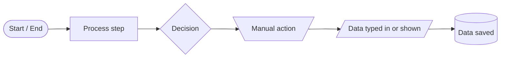
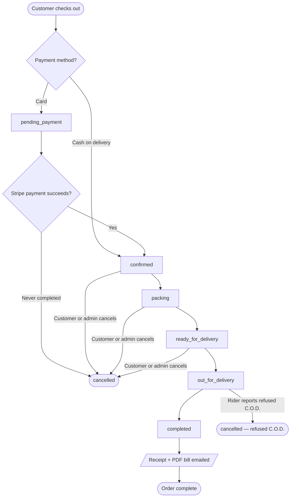
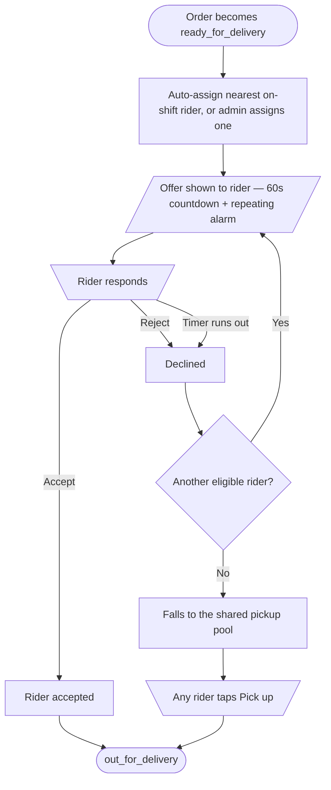
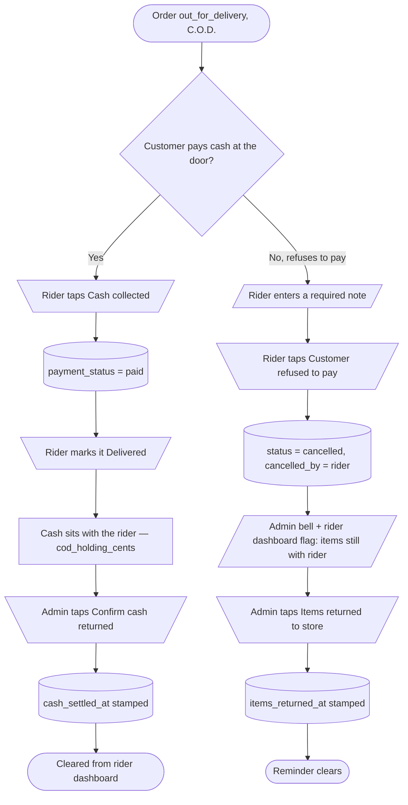
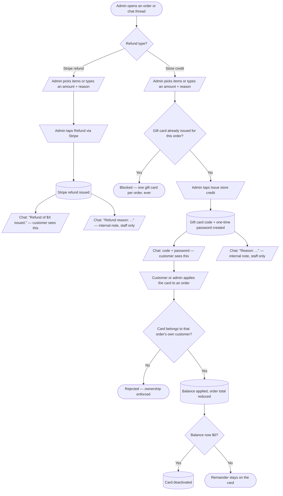
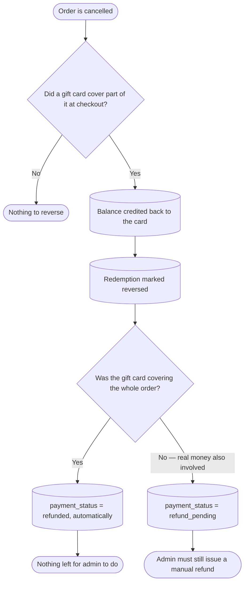
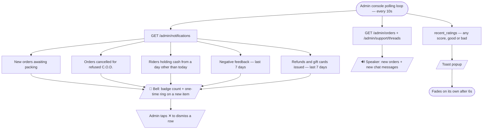

# NexTech — Major Event Flowcharts

Diagrams of the software's key end-to-end flows, using standard flowchart
notation. Rendered automatically by GitHub, GitLab, and most Markdown viewers
that support Mermaid; open in an editor otherwise for the raw diagram source.

## Legend

| Shape | Meaning |
| --- | --- |
| Stadium `([...])` | Start or end of a flow |
| Rectangle `[...]` | An automated / system process step |
| Diamond `{...}` | A decision or branch point |
| Trapezoid `[\...+/]` | A manual action — someone taps a button or does something physical |
| Parallelogram `[/.../]` | Data typed in, or a message shown/posted |
| Cylinder `[(...)]` | A value saved to the database |

---

## 1. Order lifecycle

---

## 2. Rider delivery offer

---

## 3. Cash-on-delivery cash flow

---

## 4. Refund and store-credit issuance

---

## 5. Cancelling an order with a gift card involved

---

## 6. Admin notifications

